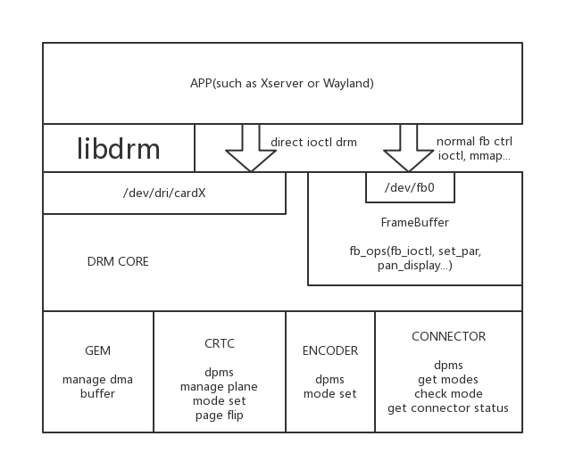

# 概述

DRM全称是Direct Rendering Manager，管理进行显示输出的, buffer分配, 帧缓冲.

libdrm库提供了一系列友好的控制封装, 使用户可以方便的进行显示的控制, 但并不是
只能通过libdrm库来控制drm, 用户可以直接操作drm的ioctl或者是使用framebuffer的
接口实现显示操作. 后面重点介绍kernel态drm的机制.

以下为drm显示大致框架:

