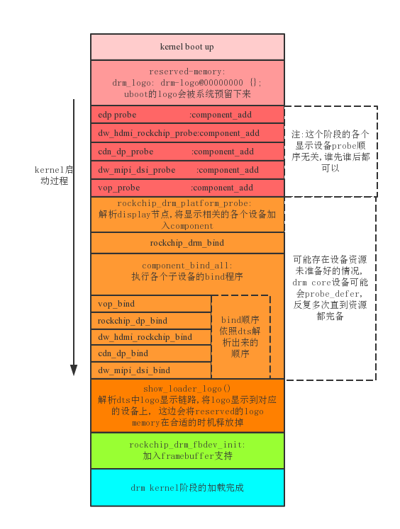

# Rockchip drm主设备

框图:

# Probe过程:
  基于component框架, 在probe阶段解析dts中各个设备的信息,
  加到component match 列表中, 等所有设备加载完毕后, 就会引发master设备的bind.

  drm/rockchip为什么需要使用Component?

    drm下挂了许多的设备, 启动顺序经常会引发各种问题:
      1.一个驱动完全有可能因为等另一个资源的准备, 而probe deferral, 导致顺序不定
      2.子设备没有加载好, 主设备就加载了, 导致设备无法工作
      3.子设备相互之间可能有时序关系,不定的加载顺序,可能带来有些时候设备能工作,有些时候又不能工作
      4.现在编kernel是多线程编译的,编译的前后顺序也会影响驱动的加载顺序.
    这时就需要有一个统一管理的机制, 将所有设备统合起来, 按照一个统一的顺序加载,
    Display-subsystem正是用来解决这个问题的, 依赖于component的驱动, 通过这个驱动,
    可以把所有的设备以组件的形式加在一起, 等所有的组件加载完毕后, 统一进行bind/unbind.

  以下为rockchip drm master probe阶段component主要逻辑, 为了减小篇幅,
  去掉了无关的代码:

    static int rockchip_drm_platform_probe(struct platform_device *pdev)
    {
    	for (i = 0;; i++) {
    		/* ports指向了vop的设备节点 */
    		port = of_parse_phandle(np, "ports", i);
    		component_match_add(dev, &match, compare_of, port->parent);
    	}
    	for (i = 0;; i++) {
    		port = of_parse_phandle(np, "ports", i);
    		/* 搜查port下的各个endpoint, 将它们也加入到match列表 */
    		rockchip_add_endpoints(dev, &match, port);
    	}
    	return component_master_add_with_match(dev, &rockchip_drm_ops, match);
    }

    static void rockchip_add_endpoints(...)
    {
    	for_each_child_of_node(port, ep) {
    		remote = of_graph_get_remote_port_parent(ep);
                /* 这边的remote即为和vop关联的输出设备, 即为edp, mipi或hdmi */
    		component_match_add(dev, match, compare_of, remote);
    	}
    }
